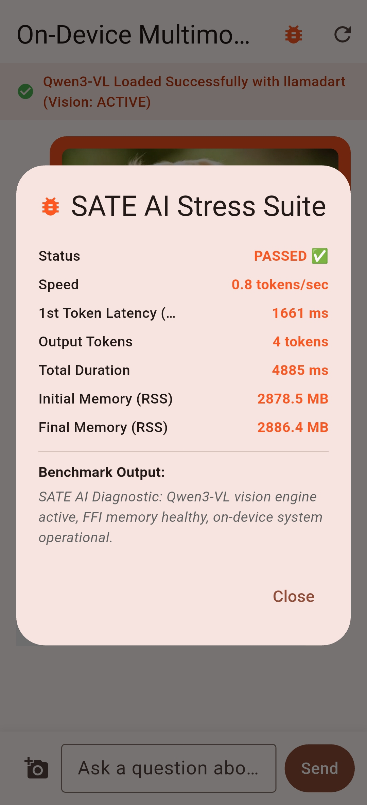

# 🚀 Qwen3-VL Mobile Vision AI (On-Device Flutter App)

An ultra-fast, privacy-first **On-Device Multimodal Vision AI** Flutter application running **Qwen3-VL-2B-Instruct** locally on Android using hardware-accelerated C++ FFI bindings (`llama.cpp` + `llamadart`). Zero cloud APIs required!

---

## 📸 App Demos & Benchmarks

<p align="center">
  
  &nbsp;&nbsp;
  
  &nbsp;&nbsp;
  
</p>

<p align="center">
  <sub><i>Left to Right: <b>Simple Query Demo</b> (Dog image), <b>Complex Query Demo</b> (Workspace scene), <b>SATE AI Stress Suite Modal</b>.</i></sub>
</p>

---

## ✨ Features

- 📱 **100% On-Device Multimodal Inference**: Describe images, answer complex visual questions, and extract visual insights completely offline.
- ⚡ **Hardware Acceleration**: Optimized for `arm64-v8a` Android devices leveraging Vulkan & Impeller GPU backends on MediaTek Helio G96 & Snapdragon platforms.
- 🛑 **Real-Time Token Streaming & Stop Controls**: Stream response tokens instantly with dynamic cancellation support (`StreamSubscription.cancel()`).
- 🎨 **ChatGPT-Style UI & Dynamic Animated Feedback**:
  - **`ThinkingIndicator`**: Animated circular progress loader + pulsing sequential dots (`.`, `..`, `...`) during initial prompt & visual encoding.
  - **`BlinkingCursor`**: Real-time cursor (`▌`) blinking at 500ms intervals attached to active token stream.
- 🧪 **Live SATE AI Stress Testing Suite**: Built-in benchmark modal (`Icons.bug_report`) measuring:
  - **Tokens / Second (t/s)** generation throughput.
  - **Time-to-First-Token (TTFT)** latency.
  - **Process Memory Footprint (RSS MB)** tracking before & after inference.
  - **Synthetic Query Fault Recovery** verification.
- 🔒 **Isolated Session Architecture**: Instantiates a clean `ChatSession` per query to eliminate KV cache context bleed and prevent OOM crashes on 8GB/4GB RAM mobile devices.

---

## 🛠️ Tech Stack & Architecture

| Layer | Technology |
| :--- | :--- |
| **Frontend Framework** | [Flutter](https://flutter.dev) (Dart 3.x, Material 3) |
| **Inference Engine** | [`llamadart`](https://pub.dev/packages/llamadart) / `llama.cpp` C++ FFI |
| **Native Toolchain** | Android NDK 28 (`Clang 19`), CMake 3.22, Ninja Build System |
| **Vision Model** | `Qwen3-VL-2B-Instruct-Q4_K_M.gguf` + `mmproj-F16.gguf` |
| **Architecture** | `arm64-v8a` (Android 10+ / API 26+) |

---

## 💥 Engineering Challenges & Solutions

### 1. Multimodal Context Bleed & Memory Overflows (OOM)
- **Challenge**: Reusing persistent `ChatSession` across multiple high-resolution image queries accumulated KV cache tensors, leading to process termination on mobile devices.
- **Solution**: Refactored `_runInference()` to create a fresh `ChatSession(_engine!)` per query, isolating memory allocation and resetting engine state cleanly.

### 2. Native Multimodal Image Handoff
- **Challenge**: Dart-side image conversion overhead introduced latency and stb_image EXIF decoding errors on raw camera JPEGs.
- **Solution**: Utilized `LlamaImageContent(path: currentImage.path)` directly, letting native C++ cross-compiled shared libraries (`libllama.so` & `libmtmd.so`) handle direct file memory mapping.

### 3. Visual Feedback & Hanging Disambiguation
- **Challenge**: Static text made it impossible for users to discern between active vision model computation vs app freeze.
- **Solution**: Built custom `ThinkingIndicator` and `BlinkingCursor` stateful widgets driven by `AnimationController` tickers for continuous real-time visual motion.

### 4. Layout Responsiveness Across Font Scalers
- **Challenge**: Android system text scaling (e.g., 1.15x) caused `RenderFlex` row overflow errors in modal dialogs.
- **Solution**: Wrapped text elements in `Expanded` widgets with `MainAxisSize.min` constraints to ensure overflow-free rendering across all mobile screen sizes.

---

## 🔮 Future Work & Performance Optimization Roadmap

Targeted performance and stability optimizations for low-spec / CPU-bound hardware (e.g. MediaTek Helio G96):

- 🎯 **Quantization Level Tuning (`Q4_0` / `Q3_K`)**: `[NOT WORKED ON]`
  - *Current Status*: App runs `Qwen3VL-2B-Instruct-Q4_K_M.gguf`. Future iterations can evaluate dropping backbone quantization to `Q4_0` or `Q3_K` for lower memory footprint and higher throughput.
- 🎯 **Context Size Bounding (`n_ctx`)**: `[NOT WORKED ON]`
  - *Current Status*: Uses default `llamadart` context initialization. Future work includes setting explicit `ContextParams` bounds tailored strictly for single-turn visual queries.
- 🎯 **Thread Count Optimization (`n_threads`)**: `[NOT WORKED ON]`
  - *Current Status*: `n_threads` currently defaults to all logical cores (8 threads), causing core contention across big (2x Cortex-A76) and little (6x Cortex-A55) cores. Pinning `n_threads` to 4–6 big cores will prevent little-core slowdowns.
- 🎯 **Pre-Inference Image Downscaling**: `[NOT WORKED ON]`
  - *Current Status*: Raw camera JPEGs are passed directly via `LlamaImageContent`. Adding Dart/Flutter-side pre-resizing/downscaling before passing images to the native vision tower will eliminate a major bottleneck.
- 🎯 **Logcat / System LMK Analysis (`lowmemorykiller` / `lmkd`)**: `[PARTIALLY WORKED ON]`
  - *Current Status*: Isolated per-query `ChatSession` instances and Dart RSS memory monitoring are implemented. Deeper kernel-level `logcat` analysis for `lmkd` / `OutOfMemoryError` events remains for future system profiling.

---

## 📂 Model Setup Guide

To run the model on your Android device:

1. Download the model files from Hugging Face:
   - **Model GGUF**: `Qwen3VL-2B-Instruct-Q4_K_M.gguf`
   - **Vision Projector**: `mmproj-Qwen3VL-2B-Instruct-F16.gguf`
2. Push the `.gguf` files to your app's external storage directory on the device:
   ```bash
   adb push Qwen3VL-2B-Instruct-Q4_K_M.gguf /sdcard/Android/data/com.example.multimodal_demo/files/model.gguf
   adb push mmproj-Qwen3VL-2B-Instruct-F16.gguf /sdcard/Android/data/com.example.multimodal_demo/files/mmproj.gguf
   ```
3. Run the app in release mode:
   ```bash
   flutter run --release
   ```

---

## 📄 License

Licensed under the [MIT License](LICENSE).

